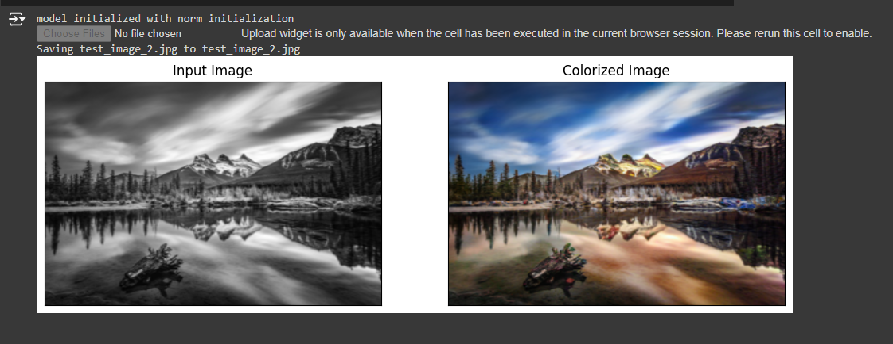

# Image Colorization

<h3 align="center">
   Test the Demo on Colab
</h3>

## Final model's output 

Left: Input black & white images from test set | Right: the colorized outputs by the final model.
